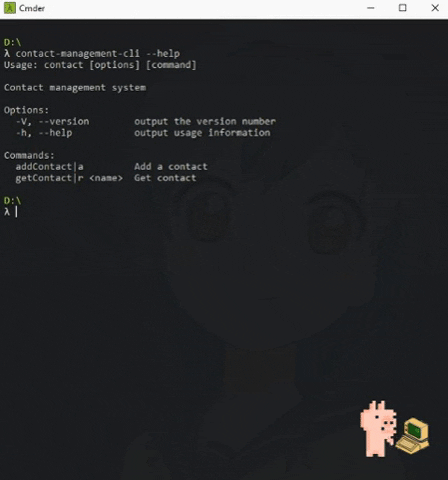

# contact-management-cli


> A command line contact management system using MongoDb



### Getting started
```sh
# Clone the repository
https://github.com/pankaryp/contact-management-cli.git
cd contact-management-cli

# Install npm dependencies
npm install

# Link package so you can use it as cli-app
npm link

# Use cli
contact-management-cli --help
```


## License

This project is licensed under the MIT License - see the [LICENSE.md](LICENSE.md) file for details.